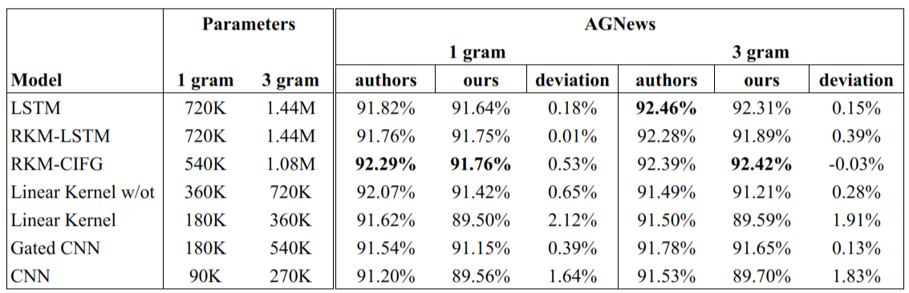
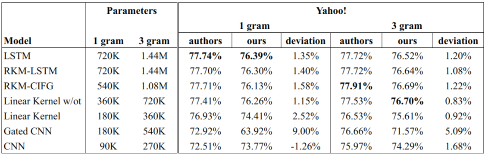
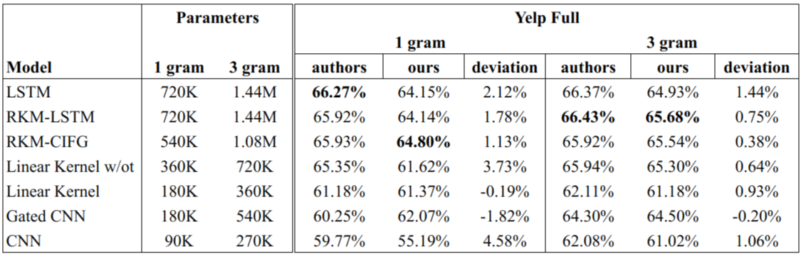

# KASM-Pytorch

Reproducing the paper "Kernel-Based Approaches for Sequence Modeling: Connections to Neural Methods"

  

## Introduction

The property of Deep Learning (DL), which says that deep learning can be viewed as a featuremapping from ψ<sub>θ</sub>(x) to the weightω, has opened up a new question of bridging the gap between deeplearning and kernel machines. Insights obtained about neural networks from the perspective of kernelmachines have proved to provide a better explanation of deep learning models. Prior work in this domain has been predominantly in the field of image analysis. Furthermore, there is significant work on the use of recurrent kernel machines (RKMs) forsequential data . Inspired by the previous work, the authors have derived connections betweenrecurrent neural networks (RNNs) and recurrent kernel machines (RKMs).The paper constructs RNN in terms of RKMs by using simple filters. These kernel machines havememory cells that are updated while the sequential data comes in. The authors introduce a methodof adaptive-gating for the adaptivity of memory of the memory cells of Recurrent Kernel Machines.And it is observed that the obtained RKM is closely related to the LSTM. Furthermore, Gated CNNand RAN are obtained from this LSTM-like framework by turning off some elements.

  

## Experiments

We carried out the experiments on the Document Classification and the Language Modelling task.

To replicate the model structure , we implemented a general LSTM cell. All the variations were thus obtained by changing the activation functions and gatedlayers in this cell. As specified in the original paper, we took the values of σ<sup>2</sup><sub>i</sub> and σ<sup>2</sup><sub>f</sub> to be 0.5 for all the four cases i.e. Linear Kernel w/ot, Linear Kernel, Gated CNN and CNN. Apart from that we also incorporated Layer Normalization whose primary purpose was to stabilize the training.

  

## Results
Considering the below tables, we can conclude that our observed training accuracy is similar to that ofmentioned in the original paper. Although our values deviate from the original values, we feel that wecan neglect those deviations, because the reasoning for these deviations could be the variance in the choice of hyperparameters like learning rate and batch size. Along with this, Figure 4 also justifies the following claims done in the original paper.
- RKM-LSTM and RKM-CIFG performs comparably to LSTM across all datasets.
- Classification accuracy decreases as the recurrent model become less sophisticated regardinggating and memory cell.  A subtle decrement is observed in the case of yelp, while forAGNews and DBpedia, 1-gram CNN performs significantly well.
- N-gram (where n>1) archives performs well as compared to 1-gram.








<p align=center>** Document classification accuracy for original paper and our implementation on variousmodels. Total parameters of each model are shown, excluding word embedding and the classifier **</p>

## References 

<!-- Original work by authors:
```bash
@article{Padam,
  title={Kernel-Based Approaches for Sequence Modeling:Connections to Neural Methods},
  author={Kevin J Liang, Guoyin Wang, Yitong Li, Ricardo Henao, Lawrence Carin},
  journal={arXiv preprint  	arXiv:1910.04233},
  year={2019}
}
``` -->
## Contributors

- [@palakg11](https://github.com/palakg11)
- [@pandeykartikey](https://github.com/pandeykartikey)
- [@ashutosh-b-b](https://github.com/ashutosh-b-b)
- [@subham103](https://github.com/subham103)

